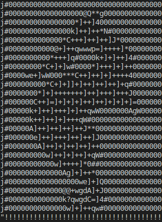

# Makefiles
The repository contains Makefile uses illustrations and implementation of an island perimeter
calculation algorithm 
The c and header files are dependencies for the Makefiles 
The examples directory contains basic use case examples for Makefile

The executable from the Makefiles should result in the following output 

## Environment
- Ubuntu 20.04
- C89
- gcc version 9.4
- python 3.8

## Usage
- clone the repository
- For makefiles, run `make -f <makefile>`
